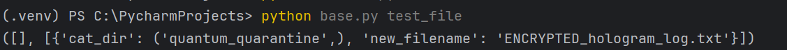
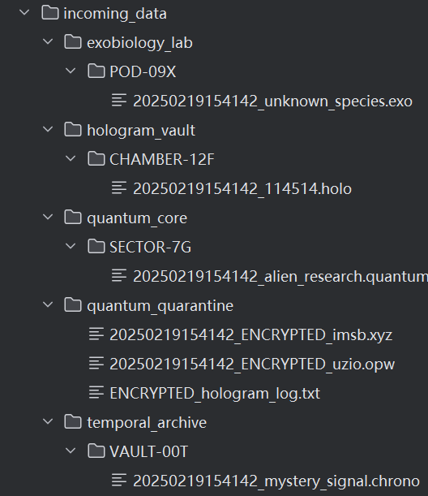
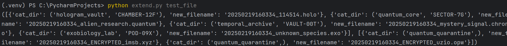
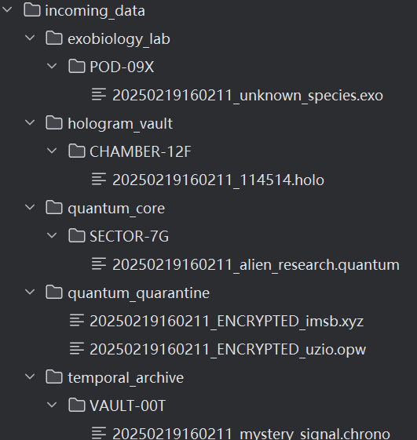
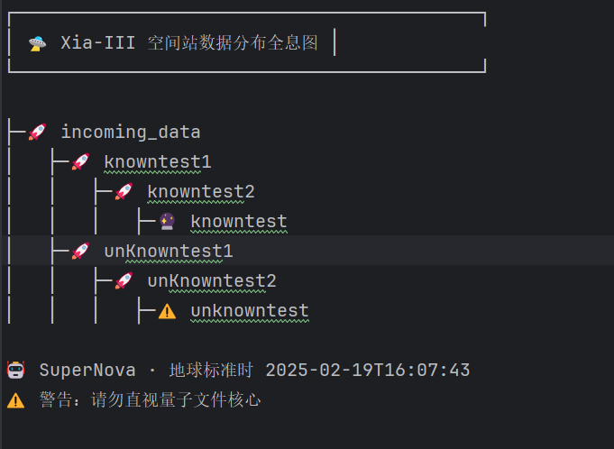
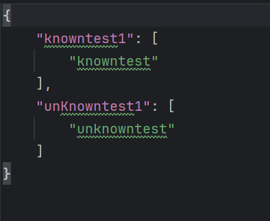

<font color="#87CEEB" size="5">🤯 **做题笔记**</font>  

### 写在前面

<details>
<summary><strong>😊 写在前面</strong></summary>

---

~~为了响应学习指导的上传**git**仓库~~，该项目已经上传到我的**github**仓库勒：
```bash
https://github.com/wwwwwwwq/lianshidai-ml
```
然后我在csdn也发有一篇讲关于git的文章，欢迎大家指正错误（）：  
```bash
https://blog.csdn.net/qq_30618989/article/details/145622471
```

---

**注：**
- 当前目录下有6个.py文件，让我逐一介绍一下：
```bash
base.py：基础题
extend.py：拓展题（默认用的写入.json格式输出，并且文件头默认带有时间戳）
ResetDir.py：重置incoming_data的文件，也就是再恢复到没有分类的状态
TestFile.py：测试分类功能
base_TestLog.py：测试以纯文本（.txt）形式输出日志
extend_TestLog.py：测试以json格式输出日志
```
- 使用脚本：  
```python
#在文本编辑软件（pycharm，vscode，vs2022等）中
直接运行的话路径就是默认在当前路径的incoming_data

#在命令行中
  #base部分
    python base.py#直接运行，路径默认是当前路径的incoming_data
    
    #path可有可无，这里path代表要修改的路径，也就是说如果数据不在当前文件夹的话
    python base.py [path] test_file#测试文件分类功能
    python base.py [path] test_log#测试日志输出功能

  #extend部分
    python extend.py#直接运行，路径默认是当前路径的incoming_data

    #path可有可无，这里path代表要修改的路径，也就是说如果数据不在当前文件夹的话
    #text_flag可有可无，代表生成的格式，1代表生成纯文本（.txt），2代表生成json格式，默认生成json格式
    python extend.py [path] test_file [text_flag]#测试文件分类功能
    python extend.py [path] test_log [text_flag]#测试日志输出功能
```
- 下面的**题目理解**和**每个步骤**等等都是基于**基础部分**写的（
~~因为好像拓展部分没什么好讲的~~），所以这里就只给出**拓展部分**的代码
，而没有具体的思路什么的。
</details>

### 理解

<details>
<summary><strong>🤔 总体理解</strong></summary>

---

这是我第一次做ml的题（悲）。之前以为ml的题都是要有GPU，
然后要跑几个小时，才能跑得了模型的那种（好像后面的题确实是）。
然后题目也很复杂，所以之前都 ~~懒得看~~ 有点望而却步。然后这题  
大概也有这种感觉（）。不过的话仔细一看其实是python的文件操作的
基础题，而且我也稍微有点python基础，所以还行写写罢。  
</details>
<details>
<summary><strong>🧠 题目理解</strong></summary>

---

大概就是说有这么几种文件：  
```
.quantum（量子碎片）  
.holo（全息投影）  
.exo（外星生物数据）  
.chrono（时间胶囊）  
以及未知格式的可疑文件  
```  
然后的话就是要编写一个python程序完成文件的分类，将未知文件进行
隔离，并且生成全息日志。  
</details>

### 输入输出

<details>
<summary><strong>💭 输入</strong></summary>

---

题目要接受一个incoming_data文件夹，这里由于题目没给所以我就
稍微创建了一个：   
```bash
incoming_data/
    114514.holo
    #有点臭不过不要在意(
    alien_research.quantum
    #什么外星人研究资料
    imsb.xyz
    #好好好
    mystery_signal.chrono
    #我累个神秘信号
    unknown_species.exo
    #神秘生物👽
    uzio.opw
    #鉴定为乱打
```
</details>
<details>
<summary><strong>💡 输出</strong></summary>

---
输出就是按如下目录存放：  
```
.quantum → 存入 quantum_core/SECTOR-7G/
.holo → 存入 hologram_vault/CHAMBER-12F/
.exo → 存入 exobiology_lab/POD-09X/
.chrono → 存入 temporal_archive/VAULT-00T/
未知文件 → 存入 quantum_quarantine/ 并重命名（前缀加 ENCRYPTED_）
```
然后是输出全息日志：
```
┌────────────────────────────────┐ 
│ 🛸 Xia-III 空间站数据分布全息图 │
└────────────────────────────────┘

├─🚀 incoming_data
│   ├─🚀 quantum_core
│   │   ├─🚀 SECTOR-7G
│   │   │   ├─🔮 alien_research.quantum 
│   ├─🚀 quantum_quarantine
│   │   ├─⚠️ ENCRYPTED_imsb.xyz

🤖 SuperNova · 地球标准时 2142-10-25T12:03:47
⚠️ 警告：请勿直视量子文件核心
```
</details>

### 拆解问题

🛠️ 那就让我们就一步一步拆解问题吧：  
<details>
<summary><strong>📁 分类文件</strong></summary>

---

### 🔍 核心逻辑
- ### 分类文件  
首先是**分类文件**。这个其实很简单，直接通过os.listdir()列出目录下的
所有文件，然后一个一个判断就可以了。  
  - **建立映射**  
在这之前，我们先预处理一下。我们可以先建立一个**后缀字典**，建立起**后缀->
目录**的映射。由于目录是包含子目录的，而且后面输出日志的时候要单独打
印子目录，所以用个**tuple**来作为值存储两个目录：  
    ```python
    #存储键为拓展名（由于os.path.splitext返回的是'.ext'，所以加了.开头），值为目录的字典
    #由于后面日志要获取每个子目录的名称，所以这里的值用tuple
    ext_dir={'.quantum':('quantum_core','SECTOR-7G'),'.holo':('hologram_vault','CHAMBER-12F'),'.exo':('exobiology_lab','POD-09X'),'.chrono':('temporal_archive','VAULT-00T')}
    
    #未知文件存储目录，也用tuple存储
    unknownFile_dir=('quantum_quarantine',)#加个,防止认为是括号
    ```

  - **处理每一个文件**  
  接下来我们就可以**处理每一个文件**了。这里我用process_file()函数
  来处理文件，并且传入路径作为参数。  
  由于最后输出日志的时候我是想着未知文件放在最后可能会好看一点，所以首先
  先创建两个空列表，一个**用来返回已知的**，一个**用来返回未知的**：  
    ```python
    #处理文件，传入路径，根据题意知存放在incoming_data下，所以用默认变量
    def process_files(directory='./incoming_data/'):
        #新建一个空列表，存储已经处理好的文件
        #这里为了可视化将未知文件放到最后一个，所以用两个列表
        knownFile_processed_files=[]
        unKnownFile_processed_files=[]
    ```
    接下来就是利用os.listdir()列出当前目录下的所有文件并进行判断了。
    首先先缓存一下文件路径**filepath**，然后利用os.path.isfile(filepath)
    来**判断是否是文件**，并且用filename.startswith('.')判断是否以.开头
    如果是的话说明是**隐藏文件**，因为windows中一般不以.开头作为文件名，这
    时候要舍掉。  
    ```python
        #遍历目录下的所有文件  
        for filename in os.listdir(directory):  
            #缓存文件路径，利用os.path.isfile()来判断是否是合法文件  
            filepath=os.path.join(directory, filename)  
      
            #如果说不是合法文件或者文件以.开头（即如果是隐藏文件），就跳过该文件并判断下一个文件  
            if not os.path.isfile(filepath) or filename.startswith('.'):  
                continue
    ```
    然后利用os.path.splitext(filename)[1].lower获取
    后缀，这里不直接用filename.split('.')是因为可能会**误判**（比如t.q.py)
    并不能取得.py的后缀，而是获得'q'。  
    ```python
            #利用os.path.splitext记录拓展名。  
            #os.path.splitext返回的是一个列表且拓展名在第二个元素，所以利用filename[1]  
            #由于题目没说是否考虑大写，这里就用lower()统一小写好了  
            ext=os.path.splitext(filename)[1].lower()
    ```
    获取后缀之后就直接判断是否在已知文件的字典里面，如果在的话就获取路径
    **cat_dir**，**不用改名**，并且用**isUnknow=False**标记:  
    ```python
            #如果拓展名是在拓展名字典中已知的，则文件存储的目录就是对应键值对的值，文件名称不变，isUnknown=False  
            if ext in ext_dir:  
                cat_dir=ext_dir[ext]  
                new_filename=filename  
                isUnknown=False#这里isUnknown是为了给后面日志输出用的
    ```
    否则的话，存储路径**cat_dir**就变成未知文件的路径，并且file的名字前面
    加上**ENCRYPTED**，标记**isUnknown=True**:  
    ```python
            #否则的话，文件存储的目录是unknownFile_dir，新名字要加前缀，isUnknown=True  
            else:  
                cat_dir=unknownFile_dir  
                #如果说原来就有ENCRYPTED前缀，那么名字就不用变（这里是我猜测的，题目没说我也不知道要不要qwq）  
                if filename.split('_')[0]=='ENCRYPTED':  
                    new_filename=filename  
                else:  
                    new_filename=f'ENCRYPTED_{filename}'#用f-string进行格式化  
                isUnknown=True  
    ```
    标记完已知文件和未知文件之后，我们可以先缓存一下文件要存到的目录路径
    为**desDir_path**，然后用os.makedirs(desDir_path)创建目录。由于
    如果已经创建了则不需要再次创建，所以我们可以加个参数**exist_ok=True**
    变成os.makedirs(desDir_path,exist_ok=True)，这样的话如果重
    复创建就不会报错，而是跳过这一步：  
    ```python
            #利用os.makedirs创建目录，如果已经创建，则不需要再创建，所以应是exist_ok=True  
            os.makedirs(desDir_path, exist_ok=True) 
    ```
    然后我们再缓存最终的文件路径**desFile_path**，因为要利用shutil.move()进行文件移动
    而需要传入路径进行参数。之后就利用shutil.move()进行移动就好了:  
    ```python
            #缓存最终的文件路径  
            desFile_path=os.path.join(desDir_path,new_filename)  
      
            #利用shutil.move移动文件  
            shutil.move(filepath, desFile_path)  
    ```
    这里不检测是否名字一样的原因是，如果移动的文件在desFile_path已经
    存在，那么说明之前在目录里面的两个文件也是名字一样的，所以不可能会有
    这种情况出现。  
      
    之后就给已知文件和未知文件列表append字典就好了，里面存储cat_dir和
    **new_filename**。处理完之后就返回两个列表。python中**返回两参数
    的话实际上是返回一个含有两个参数的tuple**：  
    ```python
            #用列表记录信息字典，以便后面的log输出  
            #这里为了可视化将未知文件放到最后一个，所以用两个列表  
            if not isUnknown:  
                knownFile_processed_files.append({'cat_dir':cat_dir,'new_filename':new_filename})  
            else:  
                unKnownFile_processed_files.append({'cat_dir': cat_dir, 'new_filename': new_filename})  
      
        #循环结束之后返回处理过的文件信息列表  
        return knownFile_processed_files,unKnownFile_processed_files
    ```
    如下是处理每一个文件的完整代码：  
    ```python
        #遍历目录下的所有文件  
        for filename in os.listdir(directory):  
            #缓存文件路径，利用os.path.isfile()来判断是否是合法文件  
            filepath=os.path.join(directory, filename)  
      
            #如果说不是合法文件或者文件以.开头（即如果是隐藏文件），就跳过该文件并判断下一个文件  
            if not os.path.isfile(filepath) or filename.startswith('.'):  
                continue  
      
            #利用os.path.splitext记录拓展名。  
            #os.path.splitext返回的是一个列表且拓展名在第二个元素，所以利用filename[1]  
            #由于题目没说是否考虑大写，这里就用lower()统一小写好了  
            ext=os.path.splitext(filename)[1].lower()  
      
            #如果拓展名是在拓展名字典中已知的，则文件存储的目录就是对应键值对的值，文件名称不变，isUnknown=False  
            if ext in ext_dir:  
                cat_dir=ext_dir[ext]  
                new_filename=filename  
                isUnknown=False#这里isUnknown是为了给后面日志输出用的  
      
            #否则的话，文件存储的目录是unknownFile_dir，新名字要加前缀，isUnknown=True  
            else:  
                cat_dir=unknownFile_dir  
                #如果说原来就有ENCRYPTED前缀，那么名字就不用变（这里是我猜测的，题目没说我也不知道要不要qwq）  
                if filename.split('_')[0]=='ENCRYPTED':  
                    new_filename=filename  
                else:  
                    new_filename=f'ENCRYPTED_{filename}'#用f-string进行格式化  
                isUnknown=True  
      
            #缓存最终的目录路径  
            desDir_path=os.path.join(directory,*cat_dir)#解包tuple  
      
            #利用os.makedirs创建目录，如果已经创建，则不需要再创建，所以应是exist_ok=True  
            os.makedirs(desDir_path, exist_ok=True)  
      
            #缓存最终的文件路径  
            desFile_path=os.path.join(desDir_path,new_filename)  
      
            #利用shutil.move移动文件  
            shutil.move(filepath, desFile_path)  
      
            #用列表记录信息字典，以便后面的log输出  
            #这里为了可视化将未知文件放到最后一个，所以用两个列表  
            if not isUnknown:  
                knownFile_processed_files.append({'cat_dir':cat_dir,'new_filename':new_filename})  
            else:  
                unKnownFile_processed_files.append({'cat_dir': cat_dir, 'new_filename': new_filename})  
      
        #循环结束之后返回处理过的文件信息列表  
        return knownFile_processed_files,unKnownFile_processed_files  
    ```
如下是process_files函数的完整代码：  
```python
#处理文件，传入路径，根据题意知存放在incoming_data下，所以用默认变量
def process_files(directory='./incoming_data/'):
    #新建一个空列表，存储已经处理好的文件
    #这里为了可视化将未知文件放到最后一个，所以用两个列表
    knownFile_processed_files=[]
    unKnownFile_processed_files=[]

    #遍历目录下的所有文件
    for filename in os.listdir(directory):
        #缓存文件路径，利用os.path.isfile()来判断是否是合法文件
        filepath=os.path.join(directory, filename)

        #如果说不是合法文件或者文件以.开头（即如果是隐藏文件），就跳过该文件并判断下一个文件
        if not os.path.isfile(filepath) or filename.startswith('.'):
            continue

        #利用os.path.splitext记录拓展名。
        #os.path.splitext返回的是一个列表且拓展名在第二个元素，所以利用filename[1]
        #由于题目没说是否考虑大写，这里就用lower()统一小写好了
        ext=os.path.splitext(filename)[1].lower()

        #如果拓展名是在拓展名字典中已知的，则文件存储的目录就是对应键值对的值，文件名称不变，isUnknown=False
        if ext in ext_dir:
            cat_dir=ext_dir[ext]
            new_filename=filename
            isUnknown=False#这里isUnknown是为了给后面日志输出用的

        #否则的话，文件存储的目录是unknownFile_dir，新名字要加前缀，isUnknown=True
        else:
            cat_dir=unknownFile_dir
            #如果说原来就有ENCRYPTED前缀，那么名字就不用变（这里是我猜测的，题目没说我也不知道要不要qwq）
            if filename.split('_')[0]=='ENCRYPTED':
                new_filename=filename
            else:
                new_filename=f'ENCRYPTED_{filename}'#用f-string进行格式化
            isUnknown=True

        #缓存最终的目录路径
        desDir_path=os.path.join(directory,*cat_dir)#解包tuple

        #利用os.makedirs创建目录，如果已经创建，则不需要再创建，所以应是exist_ok=True
        os.makedirs(desDir_path, exist_ok=True)

        #缓存最终的文件路径
        desFile_path=os.path.join(desDir_path,new_filename)

        #利用shutil.move移动文件
        shutil.move(filepath, desFile_path)

        #用列表记录信息字典，以便后面的log输出
        #这里为了可视化将未知文件放到最后一个，所以用两个列表
        if not isUnknown:
            knownFile_processed_files.append({'cat_dir':cat_dir,'new_filename':new_filename})
        else:
            unKnownFile_processed_files.append({'cat_dir': cat_dir, 'new_filename': new_filename})

    #循环结束之后返回处理过的文件信息列表
    return knownFile_processed_files,unKnownFile_processed_files
```  
</details>
<details>
<summary><strong>🔮 生成全息日志</strong></summary>

---

### 🔍 核心逻辑
- ### 生成全息日志  
  接着是要生成一个**hologram.txt**的全息日志，结构大概是这样的：  
  ```bash
  ┌────────────────────────────────┐ 
  │ 🛸 Xia-III 空间站数据分布全息图 │
  └────────────────────────────────┘
  
  ├─🚀 incoming_data
  │   ├─🚀 quantum_core
  │   │   ├─🚀 SECTOR-7G
  │   │   │   ├─🔮 alien_research.quantum 
  │   ├─🚀 quantum_quarantine
  │   │   ├─⚠️ ENCRYPTED_imsb.xyz
  
  🤖 SuperNova · 地球标准时 2142-10-25T12:03:47
  ⚠️ 警告：请勿直视量子文件核心
  ```
  那么的话，要想获得这样的结构，开头和结尾不是问题，关键是要如何处理中间
  的树状目录文件结构。  
  - **预处理数据**  
    既然它要我们处理目录和文件的话，我们首先要拿到在**分类文件**中获取的
    目录和文件名称。  
    <br>
    那么既然它要记录对应目录下的文件名称和是否是未知文件，我们就要用字典来
    储存。不过用python自带的dict不是一个明智的选择，因为它并不能**自动初始化**
    而且内存也不是**动态分配**的，万一目录一多就不好使了（当然这题目录是有限的，
    不过还是要考虑一下一般情况）。所以这个地方我就引入了一个**collections**
    包里面的**defaultdict**字典，它可以实现上面所提到的问题： 
    ```python
    from collections import defaultdict
    
    #按目录分组文件
    #这里用defaultdict来存储文件信息，不用普通的字典，因为普通的字典初始化很麻烦，且不能动态分配空间
    cat_groups=defaultdict(list)
    ```
    接下来我们就遍历**process_file()** 函数返回的 **processed_files**
    这个tuple(这里我为了方便就用**files**代替**processed_files**了)。然后从
    **files[0]**，也就是已知文件中取出**dir**和**filename**，并把**symbol**标记为'🔮'
    ，然后把**symbol**和**filename**给append进cat_groups[dir]字典中。再对未知文件
    进行同样的处理（**后处理未知文件就可以把未知文件放到字典最后**）：  
    ```python
      #遍历processed_files的文件信息，并以目录名称为键，存储标志和文件名称
      #先遍历已知文件
      for file_info in files[0]:
          dir=file_info['cat_dir']
          file=file_info['new_filename']
          symbol='🔮'
          cat_groups[dir].append({'symbol':symbol,'file':file})
  
      #再遍历未知文件
      for file_info in files[1]:
          dir=file_info['cat_dir']
          file=file_info['new_filename']
          symbol='⚠️'
          cat_groups[dir].append({'symbol':symbol,'file':file})
    ```
    以下是预处理的完整代码：  
    ```python
      #按目录分组文件
      #这里用defaultdict来存储文件信息，不用普通的字典，因为普通的字典初始化很麻烦，且不能动态分配空间
      cat_groups=defaultdict(list)
  
      #遍历processed_files的文件信息，并以目录名称为键，存储标志和文件名称
      #先遍历已知文件
      for file_info in files[0]:
          dir=file_info['cat_dir']
          file=file_info['new_filename']
          symbol='🔮'
          cat_groups[dir].append({'symbol':symbol,'file':file})
  
      #再遍历未知文件
      for file_info in files[1]:
          dir=file_info['cat_dir']
          file=file_info['new_filename']
          symbol='⚠️'
          cat_groups[dir].append({'symbol':symbol,'file':file})
    ```
  - **存储目录和文件信息**  
    接下来就是最主要的一步了，那就是我们要用列表来存储要打印的信息。
    首先初始化**lines**成**起始的信息**，然后接下来把目录信息和文件信息，
    末尾信息处理好以后就extend到lines就可以了：  
    - **打印起始信息**
      ```python
       #打印起始信息和根目录
         lines = [
             "┌───────────────────────────────────────────┐",
             "│ 🛸 Xia-III 空间站数据分布全息图 │             ",
             "└───────────────────────────────────────────┘",
             "",
             f"├─🚀 {os.path.basename(os.path.normpath(directory))}"#os.path.normpath是规范化目录，os.path.basename是取目录的最后一个部分即incoming_data
         ]   
      ```
    - **打印目录和文件信息**  
      接下来就是要**打印目录和文件信息**，这是用**树状结构**来表示的。
      那么该怎么打印呢？这里的话我稍微问了一下ai这种结构应该怎么
      存储，然后ai的回答有点不尽人意。。要么就是一直递归构建树的数据结构
      要么就是太复杂，不符合我的实际情况和整体的代码风格和逻辑。所以我干脆
      就自己手搓一个好了。首先初始化一个**dir_lines[]**列表来存储每一行
      的信息：  
      ```python
          #用一个列表记录每一行
             dir_lines=[]
      ```
      接着，就是要遍历我们预处理中构造的**cat_groups**字典，并把其中的**目录信息**
      和**文件信息**拿出来。我们先遍历**cat_groups**中的键，
      并用**dir**存储。然后对于每一个dir，我们都初始化一个缩进**dir_start**：  
      ```python
      #存储目录和文件信息到列表
         for dir in cat_groups:
             #子目录的起始缩进
             dir_start = f'│   '
      ```
      接着先拿出每一个目录，并更新和维护缩进进行存储：  
      ```python
             #存储目录
             for child_dir in dir:
                 dir_lines.append(f'{dir_start}├─🚀 {child_dir}')
                 dir_start+=f'│   '
      ```
      然后再处理文件：  
      ```python
             #记录标志和文件名称
             for filename in cat_groups[dir]:
                 #存储文件
                 dir_lines.append(f'{dir_start}├─{filename['symbol']} {filename["file"]}')
      ```
      最后把**dir_lines**给extend到**lines**中就可以了：  
      ```python
         #加入lines
         lines.extend(dir_lines)
      ```
      以下是打印目录和文件信息的完整代码：  
      ```python
        #用一个列表记录每一行
         dir_lines=[]

         #存储目录和文件信息到列表
         for dir in cat_groups:
             #子目录的起始缩进
             dir_start = f'│   '

             #存储目录
             for child_dir in dir:
                 dir_lines.append(f'{dir_start}├─🚀 {child_dir}')
                 dir_start+=f'│   '

             #记录标志和文件名称
             for filename in cat_groups[dir]:
                 #存储文件
                 dir_lines.append(f'{dir_start}├─{filename['symbol']} {filename["file"]}')

         #加入lines
         lines.extend(dir_lines)
      ```
      - **打印末尾信息**
      打印末尾信息就很简单了，记得要生成时间戳：  
      ```python
         #添加时间和警告
         timeAndClaim = [
             "",
             f"🤖 SuperNova · 地球标准时 {time}",
             "⚠️ 警告：请勿直视量子文件核心"
         ]

         lines.extend(timeAndClaim)
      ```
    以下是存储目录和文件信息的完整代码：  
    ```python
    #打印起始信息和根目录
    lines = [
        "┌───────────────────────────────────────────┐",
        "│ 🛸 Xia-III 空间站数据分布全息图 │             ",
        "└───────────────────────────────────────────┘",
        "",
        f"├─🚀 {os.path.basename(os.path.normpath(directory))}"#os.path.normpath是规范化目录，os.path.basename是取目录的最后一个部分即incoming_data
    ]

    #用一个列表记录每一行
    dir_lines=[]

    #存储目录和文件信息到列表
    for dir in cat_groups:
        #子目录的起始缩进
        dir_start = f'│   '

        #存储目录
        for child_dir in dir:
            dir_lines.append(f'{dir_start}├─🚀 {child_dir}')
            dir_start+=f'│   '

        #记录标志和文件名称
        for filename in cat_groups[dir]:
            #存储文件
            dir_lines.append(f'{dir_start}├─{filename['symbol']} {filename["file"]}')

    #加入lines
    lines.extend(dir_lines)

    #添加时间和警告
    timeAndClaim = [
        "",
        f"🤖 SuperNova · 地球标准时 {time}",
        "⚠️ 警告：请勿直视量子文件核心"
    ]

    lines.extend(timeAndClaim)
    ```
  - **构造生成日志信息的函数**  
  完成以上准备工作之后，我们就可以构造生成日志信息的函数了。我将其命名
  为generate_hologram_log()函数，它需要传入
  (files,time,dirctory='./incoming_data/')作为参数，然后我们需要定义一个
  **log_path**变量作为写入文件的路径：  
  ```python
  #生成全息日志文件hologram_log.txt，传入路径，已处理过的文件信息，log存放的路径（根据题意知存放在incoming_data下，所以用默认变量）
  #可以选择文本，1代表纯文本，2代表json格式
  def generate_hologram_log(files,time,directory='./incoming_data/'):
      #log_path记录存放日志的文件路径
      log_path=os.path.join(directory,'hologram_log.txt')
  ```
  接下来就是**预处理**，**存储目录和文件信息**，上面已经处理过了。  
  <br>
  然后最后一步就是写入，这里用到的是with open(......) as f:来写入文件
  因为这个是用（安全打开上下文）的方式进行写入文件的，并且可以传入'w'参数来
  保证修改完文件后就将其关闭，安全性高：  
  ```python
  #写入日志
    #用utf-8编码，确保能处理中文和Unicode符号
    with open(log_path,'w',encoding='utf-8') as f:
        f.write('\n'.join(lines))#用\n连接列表的每一个字符串
  ```
  到此所有工作就做完了，可以给出generate_hologram_log的完整代码了：  
  ```python
  #生成全息日志文件hologram_log.txt，传入路径，已处理过的文件信息，log存放的路径（根据题意知存放在incoming_data下，所以用默认变量）
  #可以选择文本，1代表纯文本，2代表json格式
  def generate_hologram_log(files,time,directory='./incoming_data/'):
      #log_path记录存放日志的文件路径
      log_path=os.path.join(directory,'hologram_log.txt')

    #按目录分组文件
    #这里用defaultdict来存储文件信息，不用普通的字典，因为普通的字典初始化很麻烦，且不能动态分配空间
    cat_groups=defaultdict(list)

    #遍历processed_files的文件信息，并以目录名称为键，存储标志和文件名称
    #先遍历已知文件
    for file_info in files[0]:
        dir=file_info['cat_dir']
        file=file_info['new_filename']
        symbol='🔮'
        cat_groups[dir].append({'symbol':symbol,'file':file})

    #再遍历未知文件
    for file_info in files[1]:
        dir=file_info['cat_dir']
        file=file_info['new_filename']
        symbol='⚠️'
        cat_groups[dir].append({'symbol':symbol,'file':file})

    #打印起始信息和根目录
    lines = [
        "┌───────────────────────────────────────────┐",
        "│ 🛸 Xia-III 空间站数据分布全息图 │             ",
        "└───────────────────────────────────────────┘",
        "",
        f"├─🚀 {os.path.basename(os.path.normpath(directory))}"#os.path.normpath是规范化目录，os.path.basename是取目录的最后一个部分即incoming_data
    ]

    #用一个列表记录每一行
    dir_lines=[]

    #存储目录和文件信息到列表
    for dir in cat_groups:
        #子目录的起始缩进
        dir_start = f'│   '

        #存储目录
        for child_dir in dir:
            dir_lines.append(f'{dir_start}├─🚀 {child_dir}')
            dir_start+=f'│   '

        #记录标志和文件名称
        for filename in cat_groups[dir]:
            #存储文件
            dir_lines.append(f'{dir_start}├─{filename['symbol']} {filename["file"]}')

    #加入lines
    lines.extend(dir_lines)

    #添加时间和警告
    timeAndClaim = [
        "",
        f"🤖 SuperNova · 地球标准时 {time}",
        "⚠️ 警告：请勿直视量子文件核心"
    ]

    lines.extend(timeAndClaim)

    #写入日志
    #用utf-8编码，确保能处理中文和Unicode符号
    with open(log_path,'w',encoding='utf-8') as f:
        f.write('\n'.join(lines))#用\n连接列表的每一个字符串
  ```
</details>

### 完整代码

<details>
<summary><strong>🐶 基础部分的完整代码</strong></summary>

---

```python
import json
import shutil
import os
import sys
from collections import defaultdict
from datetime import datetime

# 存储键为拓展名（由于os.path.splitext返回的是'.ext'，所以加了.开头），值为目录的字典
# 由于后面日志要获取每个子目录的名称，所以这里的值用tuple
ext_dir = {'.quantum': ('quantum_core', 'SECTOR-7G'), '.holo': ('hologram_vault', 'CHAMBER-12F'),
           '.exo': ('exobiology_lab', 'POD-09X'), '.chrono': ('temporal_archive', 'VAULT-00T')}

# 未知文件存储目录，也用tuple存储
unknownFile_dir = ('quantum_quarantine',)  # 加个,防止认为是括号


# 处理文件，传入路径，根据题意知存放在incoming_data下，所以用默认变量
def process_files(directory='./incoming_data/'):
  # 新建一个空列表，存储已经处理好的文件
  # 这里为了可视化将未知文件放到最后一个，所以用两个列表
  knownFile_processed_files = []
  unKnownFile_processed_files = []

  # 遍历目录下的所有文件
  for filename in os.listdir(directory):
    # 缓存文件路径，利用os.path.isfile()来判断是否是合法文件
    filepath = os.path.join(directory, filename)

    # 如果说不是合法文件或者文件以.开头（即如果是隐藏文件），就跳过该文件并判断下一个文件
    if not os.path.isfile(filepath) or filename.startswith('.'):
      continue

    # 利用os.path.splitext记录拓展名。
    # os.path.splitext返回的是一个列表且拓展名在第二个元素，所以利用filename[1]
    # 由于题目没说是否考虑大写，这里就用lower()统一小写好了
    ext = os.path.splitext(filename)[1].lower()

    # 如果拓展名是在拓展名字典中已知的，则文件存储的目录就是对应键值对的值，文件名称不变，isUnknown=False
    if ext in ext_dir:
      cat_dir = ext_dir[ext]
      new_filename = filename
      isUnknown = False  # 这里isUnknown是为了给后面日志输出用的

    # 否则的话，文件存储的目录是unknownFile_dir，新名字要加前缀，isUnknown=True
    else:
      cat_dir = unknownFile_dir
      # 如果说原来就有ENCRYPTED前缀，那么名字就不用变（这里是我猜测的，题目没说我也不知道要不要qwq）
      if filename.split('_')[0] == 'ENCRYPTED':
        new_filename = filename
      else:
        new_filename = f'ENCRYPTED_{filename}'  # 用f-string进行格式化
      isUnknown = True

    # 缓存最终的目录路径
    desDir_path = os.path.join(directory, *cat_dir)  # 解包tuple

    # 利用os.makedirs创建目录，如果已经创建，则不需要再创建，所以应是exist_ok=True
    os.makedirs(desDir_path, exist_ok=True)

    # 缓存最终的文件路径
    desFile_path = os.path.join(desDir_path, new_filename)

    # 利用shutil.move移动文件
    shutil.move(filepath, desFile_path)

    # 用列表记录信息字典，以便后面的log输出
    # 这里为了可视化将未知文件放到最后一个，所以用两个列表
    if not isUnknown:
      knownFile_processed_files.append({'cat_dir': cat_dir, 'new_filename': new_filename})
    else:
      unKnownFile_processed_files.append({'cat_dir': cat_dir, 'new_filename': new_filename})

  # 循环结束之后返回处理过的文件信息列表
  return knownFile_processed_files, unKnownFile_processed_files


# 生成全息日志文件hologram_log.txt，传入路径，已处理过的文件信息，log存放的路径（根据题意知存放在incoming_data下，所以用默认变量）
# 可以选择文本，1代表纯文本，2代表json格式
def generate_hologram_log(files, time, directory='./incoming_data/'):
  # log_path记录存放日志的文件路径
  log_path = os.path.join(directory, 'hologram_log.txt')

  # 按目录分组文件
  # 这里用defaultdict来存储文件信息，不用普通的字典，因为普通的字典初始化很麻烦，且不能动态分配空间
  cat_groups = defaultdict(list)

  # 遍历processed_files的文件信息，并以目录名称为键，存储标志和文件名称
  # 先遍历已知文件
  for file_info in files[0]:
    dir = file_info['cat_dir']
    file = file_info['new_filename']
    symbol = '🔮'
    cat_groups[dir].append({'symbol': symbol, 'file': file})

  # 再遍历未知文件
  for file_info in files[1]:
    dir = file_info['cat_dir']
    file = file_info['new_filename']
    symbol = '⚠️'
    cat_groups[dir].append({'symbol': symbol, 'file': file})

  # 打印起始信息和根目录
  lines = [
    "┌───────────────────────────────────────────┐",
    "│ 🛸 Xia-III 空间站数据分布全息图 │             ",
    "└───────────────────────────────────────────┘",
    "",
    f"├─🚀 {os.path.basename(os.path.normpath(directory))}"
    # os.path.normpath是规范化目录，os.path.basename是取目录的最后一个部分即incoming_data
  ]

  # 用一个列表记录每一行
  dir_lines = []

  # 存储目录和文件信息到列表
  for dir in cat_groups:
    # 子目录的起始缩进
    dir_start = f'│   '

    # 存储目录
    for child_dir in dir:
      dir_lines.append(f'{dir_start}├─🚀 {child_dir}')
      dir_start += f'│   '

    # 记录标志和文件名称
    for filename in cat_groups[dir]:
      # 存储文件
      dir_lines.append(f'{dir_start}├─{filename['symbol']} {filename["file"]}')

  # 加入lines
  lines.extend(dir_lines)

  # 添加时间和警告
  timeAndClaim = [
    "",
    f"🤖 SuperNova · 地球标准时 {time}",
    "⚠️ 警告：请勿直视量子文件核心"
  ]

  lines.extend(timeAndClaim)

  # 写入日志
  # 用utf-8编码，确保能处理中文和Unicode符号
  with open(log_path, 'w', encoding='utf-8') as f:
    f.write('\n'.join(lines))  # 用\n连接列表的每一个字符串


# 如果在交互器中运行，可以有个重置已经处理过的incoming_data
# 直接复制incoming_data_copy成incoming_data
def Reset():
  # 用try语句判断当前是否存在incoming_data
  if os.path.exists('incoming_data/'):
    shutil.rmtree('incoming_data')
    shutil.copytree('incoming_data_copy', 'incoming_data')
    print('已重置')
  else:
    print('还没有incoming_data文件夹')


# 文件分类测试，供在交互器使用
def testFile(path='./incoming_data/'):
  # 处理文件,并返回用列表存储的处理文件的信息（包括文件拓展名对应的目录，文件的新名字，文件是否是未知文件，文件的最终存储目录）
  processed_files = process_files(path)
  print(processed_files)


# 日志输出测试，供在交互器使用
def testLog():
  # 生成时间戳（精确到毫秒）
  # 用于最后log
  timestampLog = datetime.now().strftime('%Y-%m-%dT%H:%M:%S')

  # 传入随便一个列表
  test_files = [{'cat_dir': ('test1', 'test2'), 'new_filename': 'test', 'isUnknown': False}]

  generate_hologram_log(test_files, timestampLog)


# 主程序，供在交互器使用
def main(path='./incoming_data/'):
  # 生成时间戳（精确到毫秒）
  # 用于最后log
  timestampLog = datetime.now().strftime('%Y-%m-%dT%H:%M:%S')

  # 处理文件,并返回用列表存储的处理文件的信息（包括文件拓展名对应的目录，文件的新名字，文件是否是未知文件，文件的最终存储目录）
  processed_files = process_files(path)
  generate_hologram_log(processed_files, timestampLog)


# 如果在命令行或者直接在软件运行而非作为导入模块在交互器使用
if __name__ == '__main__':
  # 默认路径，不在命令行运行或者在命令行运行且格式是python base.py时默认目录是default_path
  default_path = 'incoming_data/'
  test_flag = False  # 初始化状态

  # 这里是在命令行输入参数进行各个函数运行调试
  # 如果在命令行运行，并且格式是python base.py directory则切换目录
  # 如果格式是python base.py test_file或者test_log，则目录是默认目录，而且进行文件分类或日志输出的调试
  # 如果格式是python base.py directory test_file或者test_log，则既改变目录又进行调试
  if len(sys.argv) >= 2:
    # 如果说第一个参数是test_file或者test_log的话，路径为默认路径
    if sys.argv[1] in ['test_file', 'test_log']:
      # 用test_flag来缓存状态
      test_flag = sys.argv[1]
    # 否则是目录的话，默认路径变为参数
    else:
      default_path = sys.argv[1]
      # 如果说还输入了test_file或者test_log
      if len(sys.argv) >= 3:
        test_flag = sys.argv[2]
  # 否则如果直接在pycharm或者vscode运行，直接输出内容
  else:
    main(default_path)

  # 如果是文件测试
  if test_flag == 'test_file':
    testFile()
  # 如果是日志测试
  elif test_flag == 'test_log':
    testLog()
```
</details>
<details>
<summary><strong>🐱 拓展部分的完整代码</strong></summary>

---

```python
import json
import shutil
import os
import sys
from collections import defaultdict
from datetime import datetime

#存储键为拓展名（由于os.path.splitext返回的是'.ext'，所以加了.开头），值为目录的字典
#由于后面日志要获取每个子目录的名称，所以这里的值用tuple
ext_dir={'.quantum':('quantum_core','SECTOR-7G'),'.holo':('hologram_vault','CHAMBER-12F'),'.exo':('exobiology_lab','POD-09X'),'.chrono':('temporal_archive','VAULT-00T')}

#未知文件存储目录，也用tuple存储
unknownFile_dir=('quantum_quarantine',)#加个,防止认为是括号

#处理文件，传入路径，根据题意知存放在incoming_data下，所以用默认变量
def process_files(directory='./incoming_data/',time=None):
    #新建一个空列表，存储已经处理好的文件
    #这里为了可视化将未知文件放到最后一个，所以用两个列表
    knownFile_processed_files = []
    unKnownFile_processed_files = []

    #遍历目录下的所有文件
    for filename in os.listdir(directory):
        #缓存文件路径，利用os.path.isfile()来判断是否是合法文件
        filepath=os.path.join(directory, filename)

        #如果说不是合法文件或者文件以.开头（即如果是隐藏文件），就跳过该文件并判断下一个文件
        if not os.path.isfile(filepath) or filename.startswith('.'):
            continue

        #利用os.path.splitext记录拓展名。
        #os.path.splitext返回的是一个列表且拓展名在第二个元素，所以利用filename[1]
        #由于题目没说是否考虑大写，这里就用lower()统一小写好了
        ext=os.path.splitext(filename)[1].lower()

        #如果拓展名是在拓展名字典中已知的，则文件存储的目录就是对应键值对的值，文件名称不变，isUnknown=False
        if ext in ext_dir:
            cat_dir=ext_dir[ext]
            new_filename=f'{time}_{filename}'
            isUnknown=False#这里isUnknown是为了给后面日志输出用的
            #把相同后缀加入到一个字典列表里面
            pass
        #否则的话，文件存储的目录是unknownFile_dir，新名字要加前缀，isUnknown=True
        else:
            cat_dir=unknownFile_dir
            #如果说原来就有ENCRYPTED前缀，那么名字就不用变（这里是我猜测的，题目没说我也不知道要不要qwq）
            if filename.split('_')[0]=='ENCRYPTED':
                new_filename=f'{time}_{filename}'
            else:
                new_filename=f'{time}_ENCRYPTED_{filename}'#用f-string进行格式化
            isUnknown=True
            #把相同后缀加入到一个字典列表里面
            pass

        #缓存最终的目录路径
        desDir_path=os.path.join(directory,*cat_dir)#解包tuple

        #利用os.makedirs创建目录，如果已经创建，则不需要再创建，所以应是exist_ok=True
        os.makedirs(desDir_path, exist_ok=True)

        #缓存最终的文件路径
        desFile_path=os.path.join(desDir_path,new_filename)

        #利用shutil.move移动文件
        shutil.move(filepath, desFile_path)

        #这里为了可视化将未知文件放到最后一个，所以用两个列表
        if not isUnknown:
            knownFile_processed_files.append({'cat_dir':cat_dir,'new_filename':new_filename})
        else:
            unKnownFile_processed_files.append({'cat_dir': cat_dir, 'new_filename': new_filename})

    #循环结束之后返回处理过的文件信息列表
    return knownFile_processed_files,unKnownFile_processed_files

#生成全息日志文件hologram_log.txt，传入路径，已处理过的文件信息，log存放的路径（根据题意知存放在incoming_data下，所以用默认变量）
#可以选择文本，1代表纯文本，2代表json格式
def generate_hologram_log(files,time,format_mode=1,directory='./incoming_data/'):
    #如果是纯文本
    if format_mode==1:
        #log_path记录存放日志的文件路径
        log_path=os.path.join(directory,'hologram_log.txt')

        #按目录分组文件
        #这里用defaultdict来存储文件信息，不用普通的字典，因为普通的字典初始化很麻烦，且不能动态分配空间
        cat_groups=defaultdict(list)

        #遍历processed_files的文件信息，并以目录名称为键，存储标志和文件名称
        #先遍历已知文件
        for file_info in files[0]:
            dir=file_info['cat_dir']
            file=file_info['new_filename']
            symbol='🔮'
            cat_groups[dir].append({'symbol':symbol,'file':file})

        #再遍历未知文件
        for file_info in files[1]:
            dir = file_info['cat_dir']
            file = file_info['new_filename']
            symbol = '⚠️'
            cat_groups[dir].append({'symbol': symbol, 'file': file})

        #打印起始信息和根目录
        lines = [
            "┌───────────────────────────────────────────┐",
            "│ 🛸 Xia-III 空间站数据分布全息图 │             ",
            "└───────────────────────────────────────────┘",
            "",
            f"├─🚀 {os.path.basename(os.path.normpath(directory))}"#os.path.normpath是规范化目录，os.path.basename是取目录的最后一个部分即incoming_data
        ]

        #用一个列表记录每一行
        dir_lines=[]

        #存储目录和文件信息到列表
        for dir in cat_groups:
            #子目录的起始缩进
            dir_start = f'│   '

            #存储目录
            for child_dir in dir:
                dir_lines.append(f'{dir_start}├─🚀 {child_dir}')
                dir_start+=f'│   '

            #记录标志和文件名称
            for filename in cat_groups[dir]:
                #存储文件
                dir_lines.append(f'{dir_start}├─{filename['symbol']} {filename["file"]}')

        #加入lines
        lines.extend(dir_lines)

        #添加时间和警告
        timeAndClaim = [
            "",
            f"🤖 SuperNova · 地球标准时 {time}",
            "⚠️ 警告：请勿直视量子文件核心"
        ]

        lines.extend(timeAndClaim)

        #写入日志
        #用utf-8编码，确保能处理中文和Unicode符号
        with open(log_path,'w',encoding='utf-8') as f:
            f.write('\n'.join(lines))#用\n连接列表的每一个字符串

    #否则如果是JSON格式
    elif format_mode==2:
        #log_path记录存放日志的文件路径
        log_path = os.path.join(directory, 'hologram_log.json')

        #按目录分组文件
        #这里用defaultdict来存储文件信息，不用普通的字典，因为普通的字典初始化很麻烦，且不能动态分配空间
        json_data = defaultdict(list)

        #遍历processed_files的文件信息，并以目录名称为键，存储标志和文件名称
        #先遍历已知文件
        for file_info in files[0]:
            dir_tuple=file_info['cat_dir']

            #获取最上层的目录
            #由于题目没说子目录，所以这里应该是取最上层目录
            top_dir=dir_tuple[0]

            #获取文件名
            file=file_info['new_filename']

            #添加到json_data中
            json_data[top_dir].append(file)

        #再遍历未知文件
        for file_info in files[1]:
            dir_tuple=file_info['cat_dir']

            #获取最上层的目录
            #由于题目没说子目录，所以这里应该是取最上层目录
            top_dir=dir_tuple[0]

            #获取文件名
            file=file_info['new_filename']

            #添加到json_data中
            json_data[top_dir].append(file)

        #写入json文件中
        with open(log_path,'w',encoding='utf-8') as f:
            #indent是缩进，这里缩进4格
            #ensure_ascii=False代表允许非ascii码的字符如中文
            #利用json.dump序列化列表为json格式，并写入文件
            json.dump(dict(json_data),f,indent=4,ensure_ascii=False)

#如果在交互器中运行，可以有个重置已经处理过的incoming_data
#直接复制incoming_data_copy成incoming_data
def Reset():
    #用try语句判断当前是否存在incoming_data
    if os.path.exists('./incoming_data/'):
        shutil.rmtree('./incoming_data')
        shutil.copytree('incoming_data_copy','incoming_data')
        print('已重置')
    else:
        print('还没有incoming_data文件夹')


#文件分类测试，供在交互器使用
def testFile(path='./incoming_data/'):
    # 生成时间戳（精确到毫秒）
    timestamp = datetime.now().strftime('%Y%m%d%H%M%S')

    # 处理文件,并返回用列表存储的处理文件的信息（包括文件拓展名对应的目录，文件的新名字，文件是否是未知文件，文件的最终存储目录）
    processed_files = process_files(path,timestamp)
    print(processed_files)

#日志输出测试，供在交互器使用
def testLog(format_mode=1):
    # 生成时间戳（精确到毫秒）
    # 用于最后log
    timestampLog = datetime.now().strftime('%Y-%m-%dT%H:%M:%S')

    # 传入随便一个列表
    test_files = ([{'cat_dir': ('knowntest1', 'knowntest2'), 'new_filename': 'knowntest'}],[{'cat_dir': ('unKnowntest1', 'unKnowntest2'), 'new_filename': 'unknowntest'}])

    generate_hologram_log(test_files,timestampLog,format_mode)

#主程序，供在交互器使用
def main(path='./incoming_data/',format_mode=2):
    # 生成时间戳（精确到毫秒）
    timestamp = datetime.now().strftime('%Y%m%d%H%M%S')
    # 用于最后log
    timestampLog = datetime.now().strftime('%Y-%m-%dT%H:%M:%S')

    # 处理文件,并返回用列表存储的处理文件的信息（包括文件拓展名对应的目录，文件的新名字，文件是否是未知文件，文件的最终存储目录）
    processed_files = process_files(path,timestamp)
    generate_hologram_log(processed_files,timestampLog,format_mode)

#如果在命令行或者直接在软件运行而非作为导入模块在交互器使用
if __name__=='__main__':
    #默认路径，不在命令行运行或者在命令行运行且格式是python base.py时默认目录是default_path
    default_path='./incoming_data/'
    test_flag=False#初始化状态
    text_flag=1#初始化文档状态

    #这里是在命令行输入参数进行各个函数运行调试
    #如果在命令行运行，并且格式是python base.py directory则切换目录
    #如果格式是python base.py test_file或者test_log，则目录是默认目录，而且进行文件分类或日志输出的调试
    #如果格式是python base.py directory test_file或者test_log，则既改变目录又进行调试
    if len(sys.argv)>=2:
        #如果说第一个参数是test_file或者test_log的话，路径为默认路径
        if sys.argv[1] in ['test_file','test_log']:
            #用test_flag来缓存状态
            test_flag=sys.argv[1]
            if len(sys.argv)>=3 and sys.argv[1]=='test_log':
                if sys.argv[2] in ['1','2']:
                    text_flag=int(sys.argv[2])
        #如果说第一个参数是数字的话
        elif sys.argv[1] in ['1','2']:
            text_flag=int(sys.argv[1])
        #否则是目录的话，默认路径变为参数
        else:
            default_path=sys.argv[1]
            #如果说还输入了test_file或者test_log
            if len(sys.argv)>=3:
                if sys.argv[2] in ['test_file','test_log']:
                    test_flag=sys.argv[2]
                    if len(sys.argv)>=4:
                        if sys.argv[3] in ['1','2']:
                            text_flag=int(sys.argv[3])
                elif sys.argv[2] in ['1','2']:
                    text_flag=int(sys.argv[2])

        # 如果是文件测试
        if test_flag == 'test_file':
            testFile()
        # 如果是日志测试
        elif test_flag == 'test_log':
            testLog(text_flag)
        else:
            main(default_path,text_flag)
    #否则如果直接在pycharm或者vscode运行，直接输出内容
    else:
        main(default_path)
```
</details>

### 运行截图

<details>
<summary><strong>🔧 文件分类测试运行截图</strong></summary>

---

### 基础部分  
  
- **原来**：
  
  
  
- **之后**:  
  
**命令行**：
  
  
  
**运行后**：  
  
   
  
---
  
### 拓展部分  
  
- **原来**：  
  
  
  
- **之后**：  
  
**命令行**：  
  
  
  
**运行后**：  
  
  
</details>

<details>
<summary><strong>📝 日志输出测试运行截图</strong></summary>

---

### 基础部分  
  
**命令行：**  
  
  
  
**运行后：**  
  
   
  
---  
  
### 拓展部分  
  
- **纯文本（.txt）格式**：  
    
  **命令行：**  
    
    
    
  **运行后：**   
    
      
    
- **json格式**：  
     
  **命令行：**   
    
     
    
  **运行后：**    
    
    
    
</details>
<details>
<summary><strong>🤖 完整运行截图</strong></summary>

---

### 基础部分
  
- **运行前**   
  
  
- **运行后**  
    
  **命令行**：  
    
      
    
  **运行后**：    
    
      
    
  **日志**：    
      
    
---

### 拓展部分  
  
- **纯文本（.txt）格式**    
      
  - **命令行**    
      
      
      
  - **运行后**    
      
        
      
  - **日志**    
       
        
      
- **json格式**    
      
  - **命令行**    
      
      
    
  - **运行后**    
      
        
      
  - **日志**    
       
        
      
</details>

### 总结
  
<details>
<summary><strong>📋 总结</strong></summary>
这题还是很考验python的文件操作基础的，很好的题👍。  
好像导出到pdf的时候有点bug，这里总结被吞了（悲  
</details>